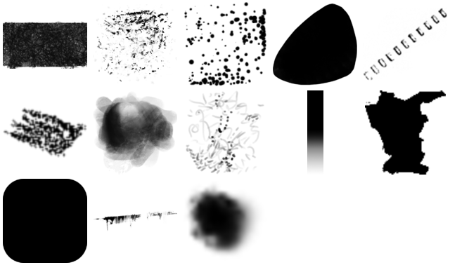
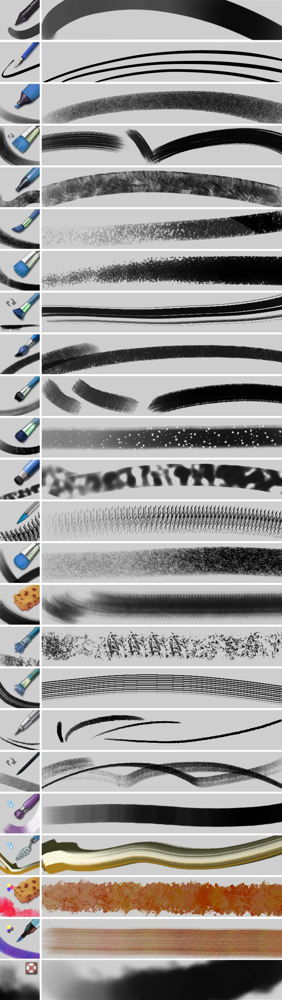
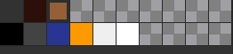
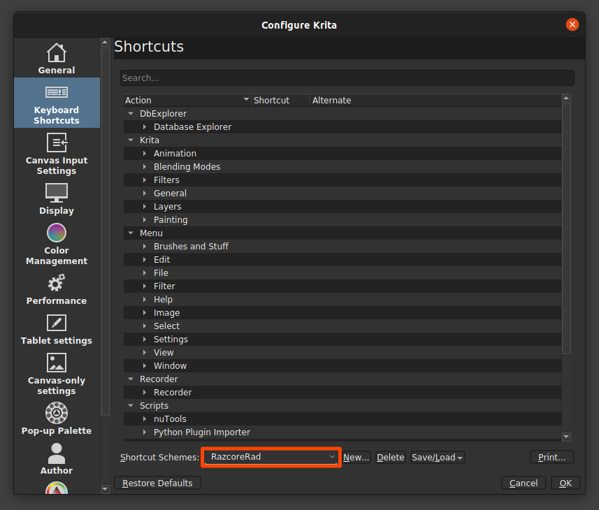
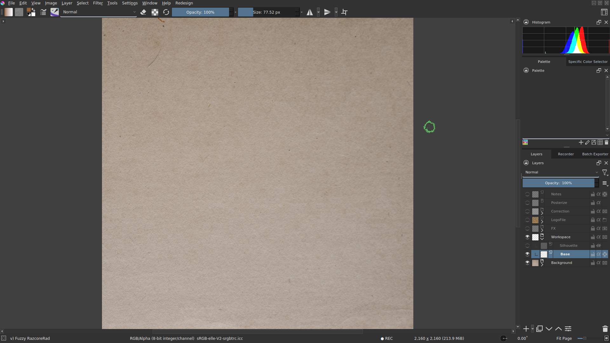

# razcore-rad's Krita resources

Download the bundle from the [Releases](https://github.com/razcore-rad/krita-resources/releases) page.

Made with Krita-5.0.0-prealpha-ebe5933.

## 140 Brushes

## 22 Paintoppresets

## 1 Palette

## 1 Pattern

## 1 Shortcuts File

## 4 Templates

## 1 Workspace

## License

Shield: [![CC BY 4.0][cc-by-shield]][cc-by]

This work is licensed under a
[Creative Commons Attribution 4.0 International License][cc-by].

[![CC BY 4.0][cc-by-image]][cc-by]

[cc-by]: http://creativecommons.org/licenses/by/4.0/
[cc-by-image]: https://licensebuttons.net/l/by/4.0/88x31.png
[cc-by-shield]: https://img.shields.io/badge/License-CC%20BY%204.0-lightgrey.svg

